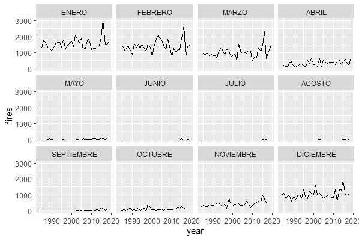
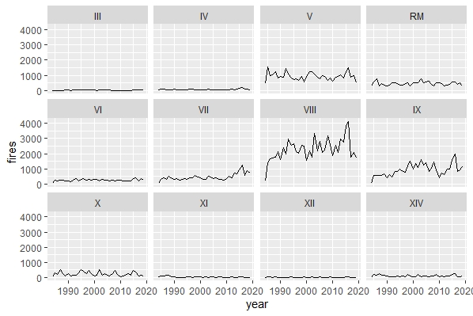
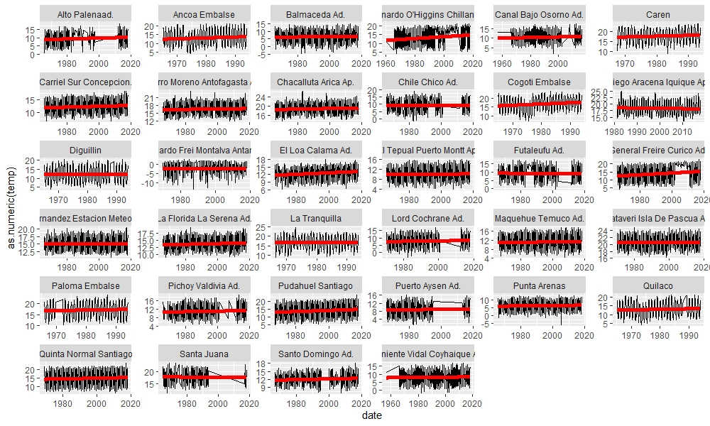
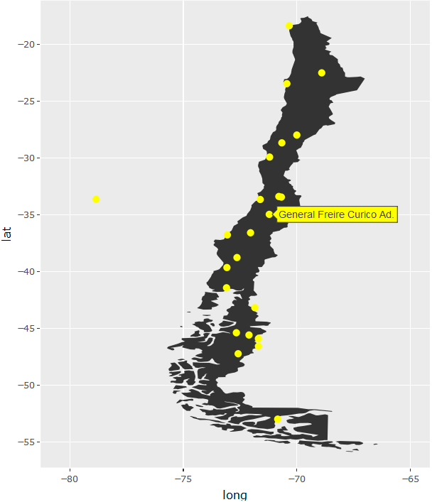
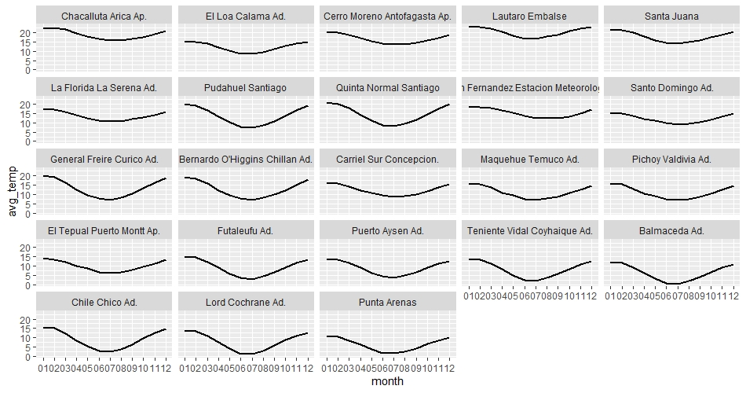
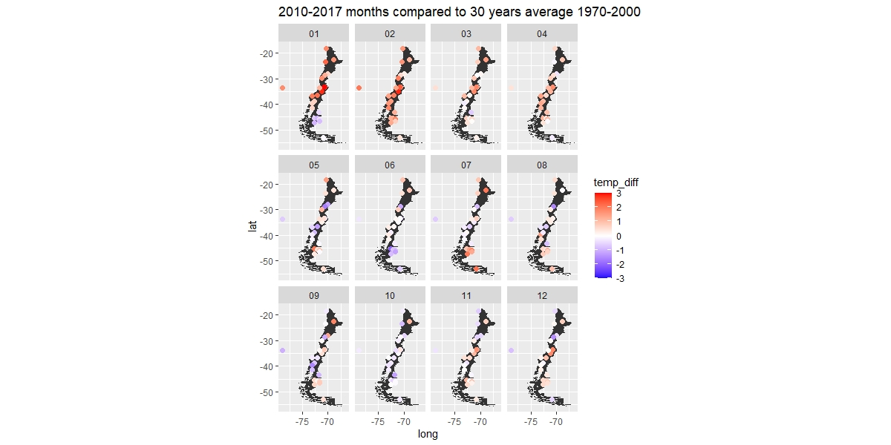

# GreenInitiatives

Code for Analysis of Temperatures and Precipitation in Chile and possible effects of climate change in forest fires and crop yields.

## Forest Fires

Data about forest firest collected by Conaf can be found [here](http://www.conaf.cl/incendios-forestales/incendios-forestales-en-chile/estadisticas-historicas/).
I cleaned the excel sheets to create easy plots:

Number of fires per month:

Number of fires per region:

## Temperatures

Data about temperatures from measuring stations in Chile can be found [here](http://www.cr2.cl/datos-de-temperatura/).

One method is to measure the temperature difference of the recent years to the 30 years average month by month.

I filtered out measuring stations where we do not have enough data and calculcated averages.

Then I could display the differences to the 30-years-average:

## Precipitation data

The data and more data can be found [here](https://psl.noaa.gov/data/gridded/data.cmap.html).

