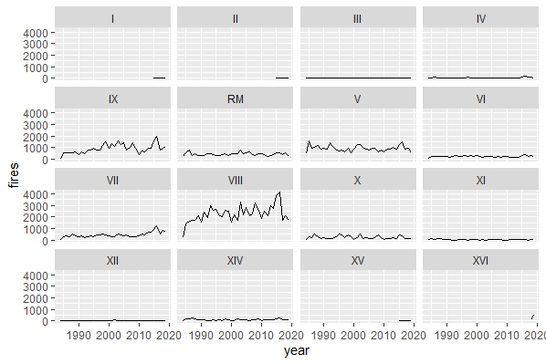

# GreenInitiatives

Code for Analysis of Temperatures and Precipitation in Chile and possible effects of climate change in forest fires and crop yields.

Data about forest firest collected by Conaf can be found [here](http://www.conaf.cl/incendios-forestales/incendios-forestales-en-chile/estadisticas-historicas/).

Number of fires per year:

Number of fires per region:

